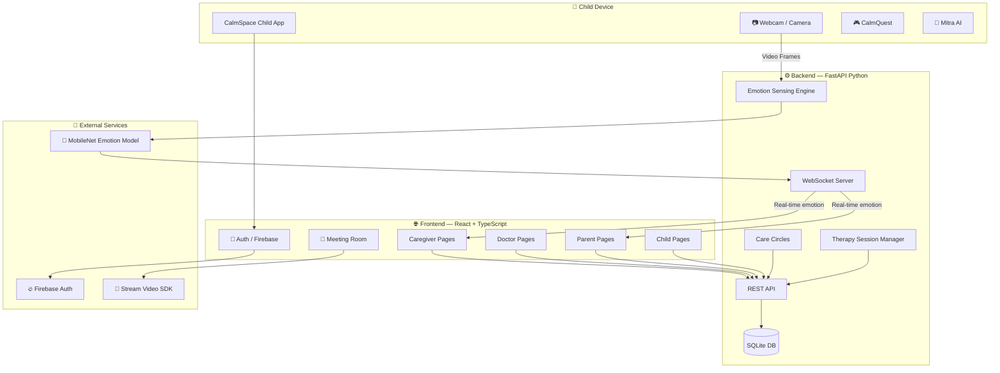
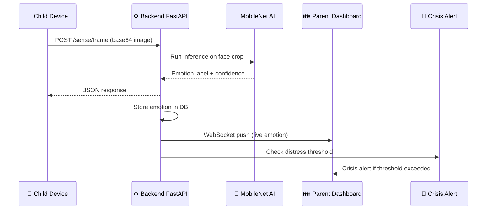
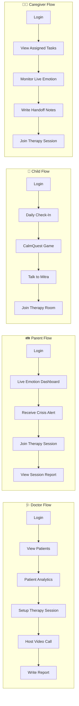
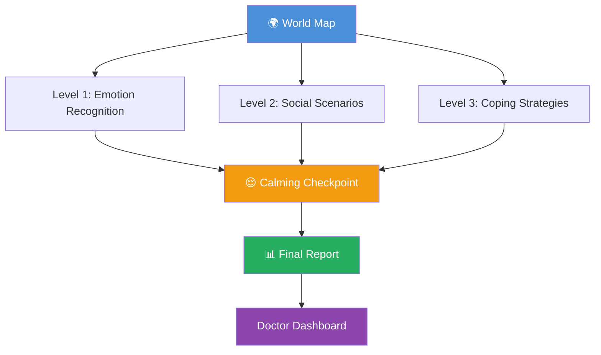
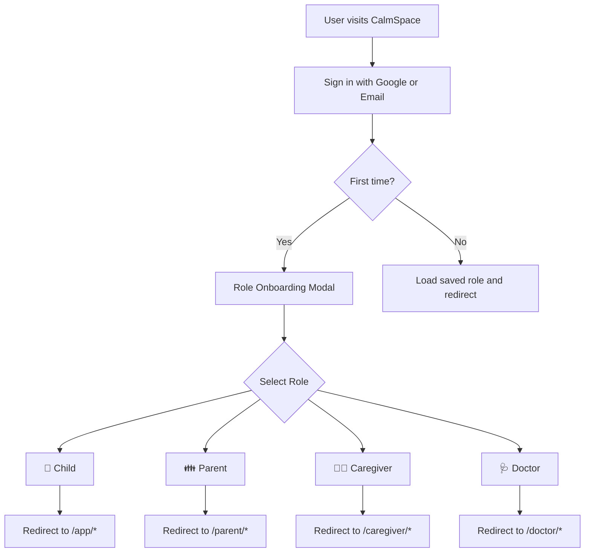
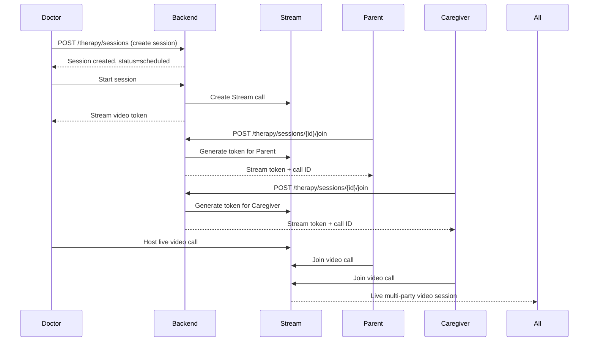
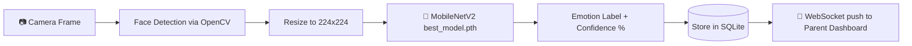

<div align="center">

# 🌿 CalmSpace

### *Empowering Children with Autism Through Technology, Empathy & Connection*

<br/>


<br/>

> **CalmSpace** is a full-stack, multi-role digital platform designed to support children with Autism Spectrum Disorder (ASD). It brings together children, parents, caregivers, and therapist-doctors into a unified ecosystem — combining real-time emotion sensing, video therapy, gamified learning, AI assistance, and collaborative care.

<br/>

[🚀 Quick Start](#-quick-start) • [📁 Project Structure](#-project-structure) • [✨ Features](#-features) • [🗺️ System Architecture](#️-system-architecture) • [🛠 Tech Stack](#-tech-stack)

</div>

---

## 📌 What is CalmSpace?

CalmSpace is a **multi-role therapy and monitoring platform** for children with Autism Spectrum Disorder (ASD). It bridges the gap between the child's daily emotional world and their entire therapy team — making it easy for:

- 👦 **Children** to express feelings, practice social skills, and take therapy sessions in a safe, gamified environment
- 👪 **Parents** to monitor their child's emotions in real time, view trends, receive crisis alerts, and join therapy sessions
- 🏥 **Caregivers** to manage daily tasks, log handoff notes, and monitor live emotional states
- 🩺 **Doctors/Therapists** to schedule and conduct therapy sessions, review patient analytics, write care plans, and export clinical reports

---

## ✨ Features

### 🧒 Child Module
| Feature | Description |
|---------|-------------|
| 🎭 Feelings Explorer | Interactive emotional check-in with facial expression guidance |
| 🤖 Mitra AI Companion | AI-powered conversational buddy for children |
| 🧩 Social Practice | Scenario-based social skill practice exercises |
| ✅ Daily Check-Ins | Quick mood/wellbeing daily log |
| 🎮 CalmQuest | Gamified therapy world with levels, Lumio avatar, world map & cinematic sequences |
| 📹 Therapy Room | Join live video therapy sessions with the doctor |

### 👪 Parent Module
| Feature | Description |
|---------|-------------|
| 📡 Live Emotion | Real-time facial emotion detection stream from the child's device |
| 📈 Emotional Trends | Charts showing emotion patterns over time |
| 🚨 Crisis Alerts | Automated alerts when distress emotions exceed threshold |
| 📋 Session Reports | Summaries from past therapy sessions |
| 🏆 Social Confidence | Track social interaction skill progress |
| 📅 Therapy Sessions | View, join, and track scheduled therapy sessions |
| 💬 Care Circle Chat | WhatsApp-style group messaging with the care team |
| 📖 History | Full emotion and session history |

### 👩‍⚕️ Caregiver Module
| Feature | Description |
|---------|-------------|
| 📡 Live Emotion | Monitor child's current emotional state |
| 🚨 Crisis Alerts | Receive real-time distress notifications |
| 📝 Assigned Tasks | View tasks assigned by the doctor |
| 📋 Handoff Notes | Create and read daily caregiver handoff notes |
| 📅 Therapy Sessions | Join scheduled video therapy sessions |
| 💬 Care Circle Chat | Communicate with the full care team |

### 🩺 Doctor Module
| Feature | Description |
|---------|-------------|
| 👥 Patient Management | View and manage full patient list |
| 📊 Patient Analytics | Detailed emotion and behavior analytics per patient |
| 🧠 Risk Score | Auto-calculated ASD risk assessment score |
| 📅 Therapy Setup | Create and schedule therapy sessions |
| 🎥 Therapy Room | Host live video therapy with participants |
| 📄 Care Plans | Write and update individualized care plans |
| 📤 Export Reports | Generate and download clinical PDF/text reports |
| 💬 Care Circle Chat | Communicate with parents and caregivers |

### 🎥 Meeting Room (Live Video Therapy)
- Real-time video & audio via **Stream Video SDK**
- Mic / Camera / Screen share controls — always-visible dark control bar
- Live **captions** using the Web Speech API
- **Download session transcript** after the call
- In-call chat panel
- Participant panel with live status
- Session recording support

---

## 🗺️ System Architecture



---

## 🔄 Data Flow — Emotion Sensing Pipeline



---

## 🧭 User Journeys



---

## 🎮 CalmQuest — Gamified Therapy Engine



---

## 🔐 Authentication & Role Flow



---

## 🎥 Video Therapy — Session Flow



---

## 📁 Project Structure

```
CalmSpace/
│
├── 📄 README.md                      # This file
├── 📄 .gitignore
│
├── 🖥️  frontend/                     # React + TypeScript + Vite application
│   ├── index.html
│   ├── vite.config.ts
│   ├── tailwind.config.ts
│   ├── tsconfig.json
│   └── src/
│       ├── App.tsx                   # Root router — all application routes
│       ├── main.tsx                  # Vite entry point
│       ├── index.css                 # CalmSpace design tokens & global styles
│       │
│       ├── pages/
│       │   ├── Home.tsx              # Public landing page
│       │   ├── Auth.tsx              # Login / Register (Firebase)
│       │   ├── About.tsx             # About CalmSpace
│       │   ├── HowItWorks.tsx        # How It Works public page
│       │   │
│       │   ├── app/                  # 👦 CHILD routes (/app/*)
│       │   │   ├── Feelings.tsx            # Emotion exploration + facial sensing
│       │   │   ├── CheckIns.tsx            # Daily mood check-in
│       │   │   ├── Mitra.tsx               # AI companion chatbot
│       │   │   ├── SocialPractice.tsx      # Social skill scenarios
│       │   │   ├── Therapy.tsx             # Therapy session listing
│       │   │   ├── ChildTherapyRoom.tsx    # Join video therapy
│       │   │   └── ChildTherapySummary.tsx # Post-session summary
│       │   │
│       │   ├── parent/               # 👪 PARENT routes (/parent/*)
│       │   │   ├── LiveEmotion.tsx         # Real-time emotion monitoring
│       │   │   ├── EmotionalTrend.tsx      # Emotion analytics charts
│       │   │   ├── CrisisAlerts.tsx        # Distress alert feed
│       │   │   ├── SessionReports.tsx      # Therapy session reports
│       │   │   ├── SocialConfidence.tsx    # Social skill progress
│       │   │   ├── TherapySessions.tsx     # View and join sessions
│       │   │   ├── TherapyRoom.tsx         # Video therapy room
│       │   │   ├── TherapySummary.tsx      # Session summary
│       │   │   ├── History.tsx             # Full history log
│       │   │   └── Chat.tsx                # Care circle chat
│       │   │
│       │   ├── caregiver/            # 👩‍⚕️ CAREGIVER routes (/caregiver/*)
│       │   │   ├── LiveEmotion.tsx         # Monitor child emotion live
│       │   │   ├── CrisisAlerts.tsx        # Receive crisis notifications
│       │   │   ├── AssignedTasks.tsx       # Daily tasks from doctor
│       │   │   ├── HandoffNotes.tsx        # Write/read shift handoffs
│       │   │   ├── TherapySessions.tsx     # Join therapy sessions
│       │   │   ├── TherapyRoom.tsx         # Video therapy room
│       │   │   ├── TherapySummary.tsx      # Session summary
│       │   │   └── Chat.tsx                # Care circle chat
│       │   │
│       │   └── doctor/               # 🩺 DOCTOR routes (/doctor/*)
│       │       ├── Patients.tsx            # Patient list
│       │       ├── PatientInfo.tsx         # Patient detail + history
│       │       ├── PatientAnalytics.tsx    # Emotion & behavior analytics
│       │       ├── RiskScore.tsx           # ASD risk scoring
│       │       ├── TherapySetup.tsx        # Create and manage sessions
│       │       ├── TherapyRoom.tsx         # Host video call
│       │       ├── TherapyReport.tsx       # Write therapy report
│       │       ├── CarePlan.tsx            # Create individualized care plan
│       │       ├── Analytics.tsx           # Dashboard analytics
│       │       ├── Export.tsx              # Export clinical reports
│       │       └── Chat.tsx                # Care circle chat
│       │
│       ├── components/
│       │   ├── MeetingRoom.tsx             # Full video meeting UI (Stream SDK)
│       │   │                               # - Dark control bar (always visible)
│       │   │                               # - Mic / Camera / Screen share
│       │   │                               # - Live captions (Web Speech API)
│       │   │                               # - Transcript download
│       │   │                               # - Recording support
│       │   ├── AppNav.tsx                  # Child app navigation
│       │   ├── ParentNav.tsx               # Parent navigation
│       │   ├── CaregiverNav.tsx            # Caregiver navigation
│       │   ├── DoctorNav.tsx               # Doctor navigation
│       │   ├── PublicNav.tsx               # Public landing navigation
│       │   ├── RoleOnboardingModal.tsx     # First-time role picker modal
│       │   │
│       │   ├── CalmQuest/                  # 🎮 Gamified therapy engine
│       │   │   ├── WorldMap.tsx            # Level selection world map
│       │   │   ├── LevelRunner.tsx         # Game level runner
│       │   │   ├── DynamicLumio.tsx        # Lumio character avatar
│       │   │   ├── CalmingCheckpoint.tsx   # Rest / breathing break
│       │   │   ├── FinalReport.tsx         # Session completion report
│       │   │   ├── Cinematic/              # Intro cinematic sequences
│       │   │   ├── Engine/                 # Core game logic engine
│       │   │   ├── Games/                  # Individual mini-games
│       │   │   └── Mechanics/              # Game mechanic primitives
│       │   │
│       │   ├── chat/
│       │   │   └── WhatsAppClone.tsx       # WhatsApp-style group chat
│       │   │
│       │   └── ui/                         # shadcn/ui component library
│       │
│       ├── contexts/
│       │   ├── AuthContext.tsx             # Firebase auth state provider
│       │   └── CalmMeetProvider.tsx        # Stream video call provider
│       │
│       ├── context/
│       │   └── EmotionContext.tsx          # Global emotion state context
│       │
│       ├── hooks/                          # Custom React hooks
│       └── lib/
│           └── therapyApi.ts               # Therapy session API functions
│
└── ⚙️  backend/                      # Python FastAPI server
    ├── main.py                       # FastAPI entry point + route mounting
    ├── models.py                     # SQLAlchemy ORM models
    ├── schemas.py                    # Pydantic request/response schemas
    ├── database.py                   # SQLite engine + session factory
    ├── therapy_server.py             # Stream Video token generation
    ├── train_mobilenet.py            # MobileNet emotion model training script
    ├── best_model.pth                # Trained MobileNet weights (9 MB)
    ├── requirements.txt              # Python dependencies
    ├── .env.example                  # Environment variable template
    ├── calmspace.db                  # SQLite database file
    │
    └── app/
        ├── auth.py                   # Firebase token verification middleware
        ├── models.py                 # App-level model definitions
        ├── database.py               # DB session utility functions
        └── routes/
            ├── sensing_routes.py     # /sense/* — emotion detection + WebSocket
            ├── care_circles.py       # /circles/* — care team group management
            ├── care_circle_ws.py     # WebSocket for real-time care circle chat
            └── therapy_sessions.py   # /therapy/* — session CRUD + Stream tokens
```

---

## 🛠 Tech Stack

### Frontend
| Technology | Version | Purpose |
|-----------|---------|---------|
| **React** | 18 | UI framework |
| **TypeScript** | 5 | Type safety |
| **Vite** | 5 | Build tool & dev server |
| **TailwindCSS** | 3 | Utility-first styling |
| **shadcn/ui** (Radix) | Latest | Accessible component library |
| **Firebase** | 10 | Authentication |
| **@stream-io/video-react-sdk** | Latest | Real-time video calling |
| **React Router** | 6 | Client-side routing |
| **TanStack Query** | 5 | Data fetching & caching |
| **Lucide React** | Latest | Icon library |
| **Recharts** | Latest | Analytics charts |
| **Web Speech API** | Browser Native | Live captions & transcription |

### Backend
| Technology | Version | Purpose |
|-----------|---------|---------|
| **FastAPI** | Latest | REST API framework |
| **Uvicorn** | Latest | ASGI server |
| **SQLAlchemy** | Latest | ORM for database access |
| **SQLite** | 3 | Embedded local database |
| **Firebase Admin SDK** | Latest | Server-side auth verification |
| **Stream Video Python SDK** | Latest | Video call token generation |
| **PyTorch** | Latest | MobileNet emotion model |
| **OpenCV** | Latest | Real-time face detection |
| **Python-Multipart** | Latest | File upload support |

---

## 🚀 Quick Start

### Prerequisites

| Tool | Minimum Version | Download |
|------|----------------|----------|
| **Node.js** | 18.x | [nodejs.org](https://nodejs.org) |
| **npm** | 9.x | Included with Node.js |
| **Python** | 3.9 | [python.org](https://python.org) |
| **Git** | Any | [git-scm.com](https://git-scm.com) |

---

### Step 1 — Clone the Repository

```bash
git clone https://github.com/yourusername/CalmSpace.git
cd CalmSpace
```

---

### Step 2 — Set Up the Backend

#### 2a. Create & activate a Python virtual environment

```bash
cd backend

# Create virtual environment
python -m venv venv

# Activate — macOS / Linux:
source venv/bin/activate

# Activate — Windows:
.\venv\Scripts\activate
```

#### 2b. Install Python dependencies

```bash
pip install -r requirements.txt
```

#### 2c. Configure environment variables

```bash
cp .env.example .env
```

Edit `.env` with your actual values:

```env
# Absolute path to your Firebase service account JSON file
FIREBASE_CREDENTIALS="/path/to/your/firebase-service-account.json"

# Stream Video API credentials — get from https://getstream.io
STREAM_API_KEY="your_stream_api_key_here"
STREAM_API_SECRET="your_stream_api_secret_here"
```

> **🔥 Getting Firebase credentials:**
> 1. Go to [Firebase Console](https://console.firebase.google.com)
> 2. Select your project → ⚙️ Project Settings → Service Accounts
> 3. Click **Generate new private key** → download the `.json` file
> 4. Set `FIREBASE_CREDENTIALS` to its absolute file path

> **📡 Getting Stream credentials:**
> 1. Sign up at [getstream.io](https://getstream.io)
> 2. Create a new **Video** application
> 3. Copy the **API Key** and **API Secret** from your dashboard

#### 2d. Start the backend server

```bash
# Make sure you're in /backend and venv is active
uvicorn main:app --reload --port 8000
```

✅ Backend running at: **http://localhost:8000**
📖 Swagger API Docs: **http://localhost:8000/docs**

---

### Step 3 — Set Up the Frontend

Open a **new terminal**:

```bash
cd CalmSpace/frontend

# Install all npm dependencies
npm install
```

#### 3a. Configure frontend environment variables

Create `frontend/.env`:

```env
VITE_FIREBASE_API_KEY=your_firebase_api_key
VITE_FIREBASE_AUTH_DOMAIN=your_project.firebaseapp.com
VITE_FIREBASE_PROJECT_ID=your_project_id
VITE_FIREBASE_STORAGE_BUCKET=your_project.appspot.com
VITE_FIREBASE_MESSAGING_SENDER_ID=your_sender_id
VITE_FIREBASE_APP_ID=your_app_id

VITE_BACKEND_URL=http://localhost:8000
VITE_STREAM_API_KEY=your_stream_api_key
```

> **🌐 Getting Firebase Web Config:**
> 1. Firebase Console → Project Settings → General
> 2. Scroll to **Your apps** → click `</>` (Web)
> 3. Copy each value from the `firebaseConfig` object

#### 3b. Start the frontend dev server

```bash
npm run dev
```

✅ Frontend running at: **http://localhost:5173**

---

### Step 4 — Open in Browser

| URL | Description |
|-----|-------------|
| `http://localhost:5173` | CalmSpace Landing Page |
| `http://localhost:5173/auth` | Login / Register |
| `http://localhost:5173/app/feelings` | Child — Feelings Explorer |
| `http://localhost:5173/parent/live-emotion` | Parent — Live Emotion |
| `http://localhost:5173/doctor/patients` | Doctor — Patient List |
| `http://localhost:8000/docs` | FastAPI Swagger UI |

---

### Running Both Servers (Two terminals)

```bash
# Terminal 1 — Backend
cd backend
source venv/bin/activate
uvicorn main:app --reload --port 8000

# Terminal 2 — Frontend
cd frontend
npm run dev
```

---

## 📡 API Overview

| Route Prefix | File | Description |
|-------------|------|-------------|
| `/users/*` | `main.py` | User registration, profile, role management |
| `/sense/*` | `sensing_routes.py` | Emotion frame upload + WebSocket stream |
| `/circles/*` | `care_circles.py` | Care circle group management |
| `/circles/ws/*` | `care_circle_ws.py` | Real-time group chat via WebSocket |
| `/therapy/*` | `therapy_sessions.py` | Session CRUD + Stream video token API |
| `/uploads/*` | Static | Uploaded images and files |

### Key Endpoints

```
POST   /users/register              Register new user
POST   /users/login                 Verify Firebase token, return profile
GET    /users/me                    Get current authenticated user

POST   /sense/frame                 Upload camera frame for emotion detection
WS     /sense/ws/{user_id}          Real-time emotion WebSocket stream

POST   /therapy/sessions            Create therapy session (Doctor only)
GET    /therapy/sessions            List sessions for current user
POST   /therapy/sessions/{id}/join  Get Stream video token to join call
POST   /therapy/sessions/{id}/end   End a session (Doctor only)

GET    /circles/                    List care circles
POST   /circles/                    Create care circle
WS     /circles/ws/{circle_id}      Real-time group chat WebSocket
```

---

## 🧠 AI — Emotion Detection Model

CalmSpace includes a custom-trained **MobileNetV2** model for real-time facial emotion classification:



**Emotions Classified:**

| Emoji | Label | Emoji | Label |
|-------|-------|-------|-------|
| 😄 | Happy | 😢 | Sad |
| 😠 | Angry | 😨 | Fear |
| 😲 | Surprised | 😐 | Neutral |
| 🤢 | Disgust | | |

**Model details:**
- Architecture: MobileNetV2 (transfer learning from ImageNet)
- Input: 224×224 RGB face crop
- Output: 7-class softmax
- Training script: `backend/train_mobilenet.py`
- Trained weights: `backend/best_model.pth` (~9 MB)

---

## 🌿 Design System

CalmSpace uses a warm, calm, and accessible color palette built for neurodivergent users:

| Token | Light Mode Value | Usage |
|-------|-----------------|-------|
| `--background` | Soft cream `hsl(48 95% 92%)` | Page background |
| `--card` | Warm white `hsl(48 100% 97%)` | Cards, side panels |
| `--primary` | Sky blue `hsl(205 85% 68%)` | Buttons, accents |
| `--secondary` | Warm yellow `hsl(45 100% 60%)` | Highlights |
| `--foreground` | Near-black `hsl(0 0% 8%)` | Body text |

**Design principles:**
- 🎨 Low-saturation tones — gentle on sensory sensitivities
- 🔤 **Inter** typeface — clear and legible at all sizes
- 🪄 Subtle micro-animations — never jarring or overwhelming
- 📱 Fully responsive — mobile, tablet, and desktop
- ♿ WCAG AA accessible contrast ratios throughout
- 🖤 Meeting Room always uses a dark theme for control visibility

---

## 🗂️ Environment Variables Reference

### Backend — `backend/.env`

| Variable | Required | Description |
|----------|----------|-------------|
| `FIREBASE_CREDENTIALS` | ✅ Yes | Absolute path to Firebase service account `.json` |
| `STREAM_API_KEY` | ✅ Yes | Stream Video API key |
| `STREAM_API_SECRET` | ✅ Yes | Stream Video API secret |

### Frontend — `frontend/.env`

| Variable | Required | Description |
|----------|----------|-------------|
| `VITE_FIREBASE_API_KEY` | ✅ Yes | Firebase Web API key |
| `VITE_FIREBASE_AUTH_DOMAIN` | ✅ Yes | Firebase auth domain |
| `VITE_FIREBASE_PROJECT_ID` | ✅ Yes | Firebase project ID |
| `VITE_FIREBASE_STORAGE_BUCKET` | ✅ Yes | Firebase storage bucket |
| `VITE_FIREBASE_MESSAGING_SENDER_ID` | ✅ Yes | Firebase messaging sender ID |
| `VITE_FIREBASE_APP_ID` | ✅ Yes | Firebase app ID |
| `VITE_BACKEND_URL` | ✅ Yes | Backend URL (default: `http://localhost:8000`) |
| `VITE_STREAM_API_KEY` | ✅ Yes | Stream Video API key |

---

## 🐛 Troubleshooting

### ❌ Backend won't start — "No module named X"
```bash
# Activate virtual environment first
source venv/bin/activate      # macOS/Linux
.\venv\Scripts\activate       # Windows

pip install -r requirements.txt
```

### ❌ Frontend shows "Network Error" or can't reach backend
- Is the backend running on port 8000? (`uvicorn main:app --reload --port 8000`)
- Check `VITE_BACKEND_URL` in `frontend/.env`
- CORS is already open in `main.py` for development

### ❌ Firebase login not working
- Enable **Email/Password** and **Google** sign-in in your Firebase console
- Ensure `frontend/.env` Firebase credentials match your project exactly

### ❌ Video call won't connect
- Ensure `STREAM_API_KEY` and `STREAM_API_SECRET` are set in **both** `.env` files
- The therapy session must be in **live** status before anyone can join
- Grant **camera and microphone** permissions in the browser

### ❌ Emotion detection not working
- Allow camera access (app must run on `localhost` or HTTPS)
- Ensure PyTorch and OpenCV installed: `pip install -r requirements.txt`
- Check `backend/best_model.pth` exists (it's ~9 MB)

### ❌ Live captions not working in meeting
- Browser must support **Web Speech API** (Chrome/Edge recommended)
- Allow microphone permission when prompted
- Captions transcribe your own microphone in real time

---

## 🤝 Contributing

1. **Fork** the repository
2. **Create a branch**: `git checkout -b feature/your-feature-name`
3. **Make changes** with clear, documented code
4. **Commit**: `git commit -m "feat: description of change"`
5. **Push**: `git push origin feature/your-feature-name`
6. **Open a Pull Request**

### Commit Convention
```
feat:      New feature
fix:       Bug fix
docs:      Documentation update
style:     Formatting only
refactor:  Code restructure (no logic change)
test:      Tests added or fixed
chore:     Build, CI, dependencies
```

---

## 📜 License

This project is licensed under the **MIT License**.

---

## 🌟 Acknowledgements

- [Stream Video SDK](https://getstream.io/video/) — Real-time video infrastructure
- [Firebase](https://firebase.google.com) — Authentication platform
- [shadcn/ui](https://ui.shadcn.com) — Beautiful accessible UI components
- [FER2013 / AffectNet](https://www.kaggle.com/) — Emotion model training datasets
- Every family, therapist, and caregiver who inspired this work

---

<div align="center">

### Built with ❤️ for every child who deserves to be understood

*CalmSpace — Because every emotion matters.*

<br/>


</div>
